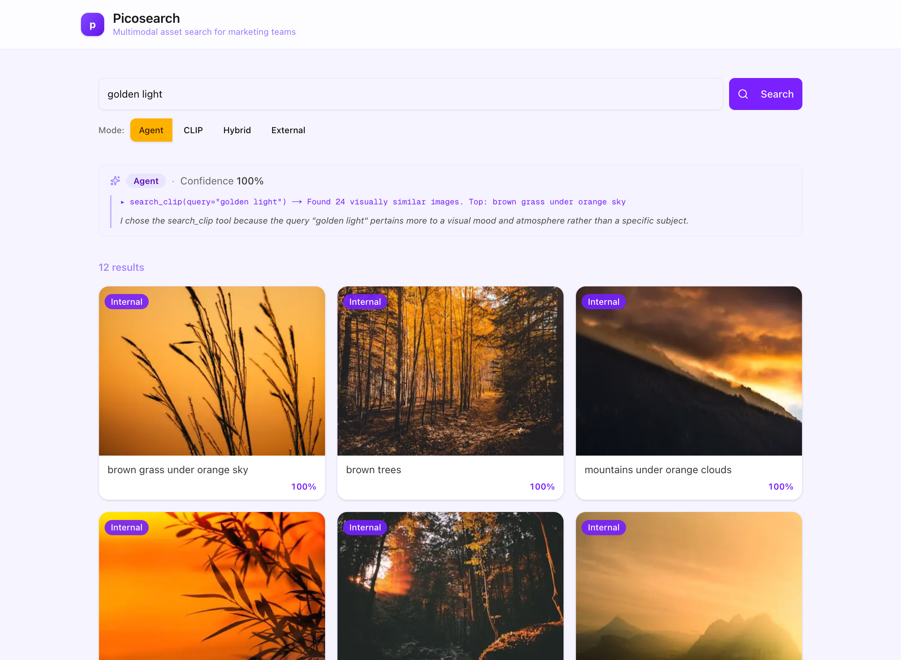

# Picosearch

Multimodal asset search demo app for marketing teams. Search your media library using natural language, visual concepts, or let an AI agent pick the best approach for your query.



## Overview

Picosearch is a full-stack image search application that combines multiple search strategies to help marketing teams find the right visual assets. It supports:

- **Hybrid search**: Combines traditional text matching against image descriptions and tags with OpenAI embeddings on descriptions via reciprocal rank fusion
- **CLIP visual search**: Find images by visual mood, aesthetics, and atmosphere
- **External search**: Pexels API fallback for stock imagery
- **Agent mode**: A LangGraph agent that intelligently selects the best search strategy based on your query

## Architecture

```
┌─────────────────┐     ┌─────────────────┐     ┌─────────────────┐
│   Next.js       │────▶│   FastAPI       │────▶│   OpenSearch    │
│   Frontend      │     │   + LangGraph   │     │   (kNN + BM25)  │
└─────────────────┘     └─────────────────┘     └─────────────────┘
                              │
                              ├──▶ OpenAI (GPT-4o-mini for agent, openai-text-embedding-3-small for text embeddings)
                              ├──▶ CLIP (openai/clip-vit-base-patch32) for visual embeddings — stand-in for a production inference endpoint
                              ├──▶ Cohere rerank-v3.5 for result reranking
                              └──▶ Pexels (external images)
```

## Search Modes

| Mode         | Description                                                                                   |
| ------------ | --------------------------------------------------------------------------------------------- |
| **Agent**    | ReAct agent decides between search strategies based on query intent. Best for varied queries. |
| **CLIP**     | Direct CLIP kNN search. Best for visual moods, aesthetics, lighting, and atmosphere.          |
| **Hybrid**   | Keyword + semantic embeddings with RRF. Good for descriptive, subject-based queries.          |
| **External** | Pexels stock photo search. Fallback when internal library lacks coverage.                     |

## Note

This is intended to be a demo app. This demo runs CLIP locally for simplicity. For production replace local CLIP with a hosted service or inference endpoint. (SageMaker, Replicate, Modal, etc.)

## License

MIT
